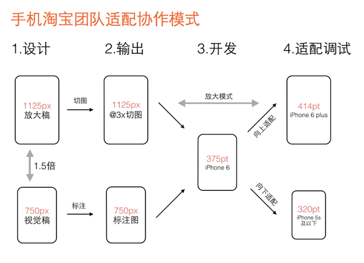

## 终端适配
- 终端适配多种尺寸屏幕，让网页效果看起来和设计师的设计稿一样，说白了就是同一套代码在不同分辨率的手机上展现时，页面元素间的间距，留白，以及图片大小会随着改变，在比例上跟设计稿一致。
- 布局的传统解决方案，基于盒状模型(标准模型和IE模型)，依赖于 display position float 属性，实现Div+Css布局，随着屏幕分辨率越来越多，需要适配的终端越来越多。随着css3的普及，可选的适配解决方案也越来越多。

- 设计师和前端开发的适配协作基本思路是
  1. 选择一种尺寸作为设计和开发基准
  2. 定义一套适配规则，自动适配剩下的两种尺寸（其实不是两种，你懂的）
  3. 特殊适配效果给出设计效果
  4. 

* 使用rem单位来做网页适配
* 使用viewport的缩放功能来实现适配
* 使用媒体查询响应式布局来达到适配
* 使用自适应百分比达到适配
